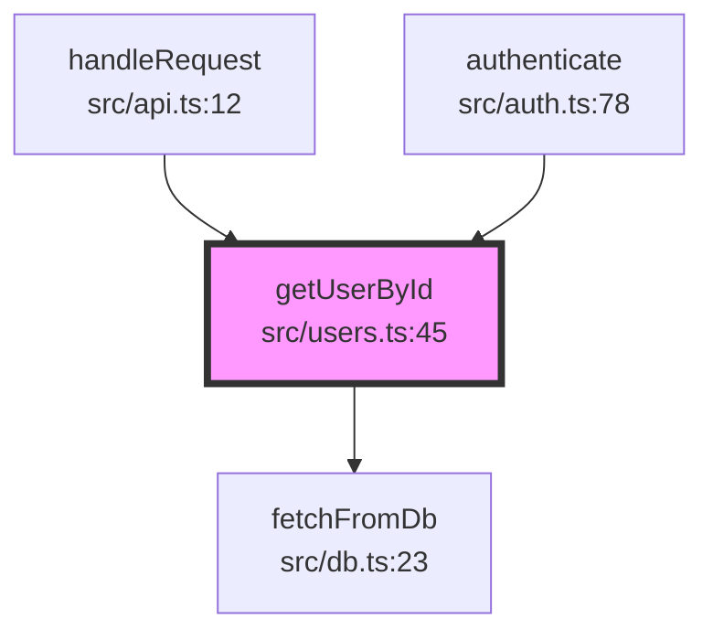

# funcflow

[](https://www.npmjs.com/package/funcflow)
[](https://opensource.org/licenses/MIT)
[](http://makeapullrequest.com)

> MCP server for analyzing function call graphs in TypeScript/JavaScript and Python codebases

## What is funcflow?

funcflow helps developers understand complex codebases by analyzing and visualizing function call relationships. It integrates seamlessly with [Claude Code](https://claude.ai/code) via the Model Context Protocol (MCP).

Simply ask Claude "Show me what calls getUserById" and funcflow will automatically:

- Analyze your codebase using the TypeScript Compiler API or regex-based Python parsing
- Find all callers and callees
- Generate beautiful Mermaid diagrams
- Show results directly in Claude Code

### Supported Languages

- **TypeScript/JavaScript** - Full type-aware analysis using the TypeScript Compiler API
- **Python** - Regex-based parsing for functions, classes, methods, and imports

## Why funcflow? (vs madge, dependency-cruiser)

funcflow goes beyond simple dependency visualization with unique **Impact Analysis** features:

| Feature                 | funcflow | madge           | dependency-cruiser |
| ----------------------- | -------- | --------------- | ------------------ |
| Function-level analysis | Yes      | No (file-level) | Limited            |
| Impact analysis         | Yes      | No              | No                 |
| Risk scoring            | Yes      | No              | No                 |
| Transitive callers      | Yes      | No              | No                 |
| Hotspot detection       | Yes      | No              | No                 |
| Smart suggestions       | Yes      | No              | Rule-based only    |
| MCP integration         | Yes      | No              | No                 |

### Unique Differentiators

**1. Impact Analysis** - Answer "If I change this function, what else might break?"

- Calculate risk scores based on caller count and complexity
- Show transitive impact (callers of callers, up to N levels deep)
- Detect circular dependencies automatically

**2. Complexity Metrics** - Built into every analysis

- Fan-in (number of callers) / Fan-out (number of callees)
- Cyclomatic complexity hints
- Hotspot detection (functions with high fan-in AND fan-out)

**3. Smart Suggestions** - Actionable insights, not just data

- "This function has 15 callers - consider if changes are safe"
- "Circular dependency detected: A -> B -> A"
- "This function calls 20 others - consider breaking it up"

## Features

- **Multi-Language Support** - TypeScript/JavaScript and Python analysis
- **Smart Analysis** - Uses TypeScript Compiler API for accurate type-aware analysis
- **Impact Analysis** - Know the blast radius before making changes
- **Risk Scoring** - Quantified risk assessment (low/medium/high/critical)
- **Hotspot Detection** - Find the most critical junction points in your code
- **Circular Dependency Detection** - Automatic detection with clear visualization
- **Beautiful Visualizations** - Mermaid diagrams, ASCII trees, and JSON export
- **Configurable Depth** - Control how deep to traverse the call graph (1-10 levels)
- **Fast Performance** - Analyzes most functions in <500ms
- **Zero Config** - Works out of the box with any TypeScript/JavaScript or Python project
- **Secure** - Path validation and input sanitization built-in
- **Free & Open Source** - MIT licensed, always free

## Quick Start

### Installation

```bash
# Using npx (no installation needed)
npx funcflow

# Or install globally
npm install -g funcflow
```

### Configure Claude Code

Add to your Claude Code MCP configuration (`~/.claude/settings.json`):

```json
{
  "mcpServers": {
    "funcflow": {
      "command": "npx",
      "args": ["-y", "funcflow"]
    }
  }
}
```

### Usage

Once configured, ask Claude naturally:

```
You: "Show me what calls the getUserById function"
You: "What does processOrder call?"
You: "Analyze the handleCheckout function with depth 3"
```

Claude will automatically use funcflow to analyze your code and show beautiful call graph visualizations.

## MCP Tools

funcflow provides four MCP tools:

### analyze_function_calls

Analyze function call relationships and generate visualizations with smart insights.

**Parameters:**

- `functionName` (required): Name of the function to analyze
- `projectRoot` (required): Absolute path to project root
- `filePath` (optional): Specific file to search in
- `depth` (optional, default: 2): How deep to traverse (1-10)
- `direction` (optional, default: "both"): "callers", "callees", or "both"

**Output includes:**

- Mermaid diagram visualization
- Fan-in/Fan-out metrics
- Smart suggestions (warnings about high-impact functions, refactoring hints)

### analyze_impact

**NEW** - Comprehensive impact analysis for a function. Use this before making changes.

**Parameters:**

- `functionName` (required): Name of the function to analyze
- `projectRoot` (required): Absolute path to project root
- `filePath` (optional): Specific file to search in
- `depth` (optional, default: 3): How many levels of transitive callers to analyze

**Output includes:**

- Risk score (0-100) with level (low/medium/high/critical)
- Direct callers list
- Transitive callers (callers of callers) by depth level
- Complexity metrics (fan-in, fan-out, cyclomatic complexity, hotspot score)
- Circular dependencies detection
- Smart suggestions with severity levels

### find_function

Find all definitions of a function by name.

**Parameters:**

- `functionName` (required): Name of the function to find
- `projectRoot` (required): Absolute path to project root

### visualize_callgraph

Generate a visualization in a specific format. JSON output now includes complexity metrics.

**Parameters:**

- `functionName` (required): Name of the function
- `projectRoot` (required): Absolute path to project root
- `format` (required): "mermaid", "ascii", or "json"
- `depth` (optional, default: 2): How deep to traverse
- `direction` (optional, default: "both"): Analysis direction

**JSON output includes:**

- All nodes and edges with locations
- Complexity metrics (fan-in, fan-out, hotspot detection)
- Circular dependencies
- Smart suggestions

## Example Output

### Mermaid Diagram



### ASCII Tree

```
getUserById (src/users.ts:45) ●
├── Called by:
│   ├── handleRequest (src/api.ts:12)
│   └── authenticate (src/auth.ts:78)
└── Calls:
    └── fetchFromDb (src/db.ts:23)
```

### Impact Analysis Output

```
## Impact Analysis: `processOrder`

**Location:** services/order.ts:142

### Risk Assessment

- **Risk Score:** 45/100 [HIGH]
- **Risk Level:** HIGH
- **Total Functions Potentially Affected:** 12

### Direct Callers (8)

- `handleCheckout`
- `processRefund`
- `batchOrderProcessor`
- `orderApiHandler`
- `webhookHandler`
- ...and 3 more

### Transitive Impact

**Level 1:** 8 function(s)
**Level 2:** 4 function(s)
  - `apiRouter`
  - `mainHandler`
  - ...

### Complexity Metrics

- **Fan-In (callers):** 8
- **Fan-Out (callees):** 6
- **Cyclomatic Complexity:** 12
- **Hotspot:** Yes - High Risk
- **Hotspot Score:** 67/100

### Circular Dependencies Detected

- processOrder -> validateInventory -> checkOrder -> processOrder

### Suggestions

[!] "processOrder" is a hotspot (high fan-in AND fan-out) - changes here are high-risk
[!] This function has 8 callers - consider if changes are safe
[!] Circular dependency detected: processOrder -> validateInventory -> checkOrder -> processOrder
[R] High cyclomatic complexity (12) - consider simplifying the logic
```

## Development

```bash
# Clone the repository
git clone https://github.com/fairy-pitta/funcflow.git
cd funcflow

# Install dependencies
npm install

# Run tests
npm test

# Run tests with coverage
npm run test:coverage

# Build
npm run build

# Development mode (watch)
npm run dev
```

## Configuration

funcflow works with zero configuration. It automatically detects:

- `tsconfig.json` for TypeScript projects
- JavaScript/JSX/TSX files
- `pyproject.toml`, `requirements.txt`, or `setup.py` for Python projects
- `.py` files for Python analysis

The language is auto-detected based on project configuration files and source file extensions.

### Environment Variables

- `FUNCFLOW_LOG_LEVEL`: Logging level (`debug`, `info`, `warn`, `error`). Default: `info`

## Project Structure

```
funcflow/
├── src/
│   ├── analyzer/       # Multi-language analysis engine
│   │   ├── project-scanner.ts
│   │   ├── function-finder.ts
│   │   ├── call-analyzer.ts
│   │   ├── impact-analyzer.ts  # Impact analysis & risk scoring
│   │   ├── typescript-analyzer.ts  # Main entry point with language detection
│   │   └── python/     # Python analyzer module
│   │       ├── python-scanner.ts   # Find Python files
│   │       ├── python-parser.ts    # Parse Python using regex
│   │       └── python-analyzer.ts  # Python call graph analysis
│   ├── graph/          # Call graph building
│   │   ├── types.ts
│   │   └── builder.ts
│   ├── visualizer/     # Output generation (with complexity metrics)
│   │   ├── mermaid.ts
│   │   ├── ascii.ts
│   │   └── json.ts     # Includes complexity metrics & suggestions
│   ├── mcp/            # MCP server implementation
│   │   ├── server.ts
│   │   ├── handlers.ts
│   │   ├── tools.ts    # 4 tools including analyze_impact
│   │   └── types.ts
│   ├── constants/      # Error messages
│   │   └── errors.ts
│   ├── utils/          # Utilities
│   │   └── logger.ts
│   └── index.ts        # Entry point
├── tests/              # Test suite
├── docs/               # Documentation
└── plan/               # Implementation plans
```

## Contributing

We welcome contributions! Please see [CONTRIBUTING.md](./CONTRIBUTING.md) for guidelines.

1. Fork the repository
2. Create a feature branch (`git checkout -b feature/amazing-feature`)
3. Write tests for your changes
4. Ensure all tests pass (`npm test`)
5. Commit with clear messages
6. Open a Pull Request

## License

MIT © [fairy-pitta](https://github.com/fairy-pitta)

## Support

- [Report Issues](https://github.com/fairy-pitta/funcflow/issues)
- [Discussions](https://github.com/fairy-pitta/funcflow/discussions)
- Star this repo if you find it useful!

## Acknowledgments

This project was inspired by the need for better tools to understand function call relationships, especially when using AI coding assistants like Claude Code.
