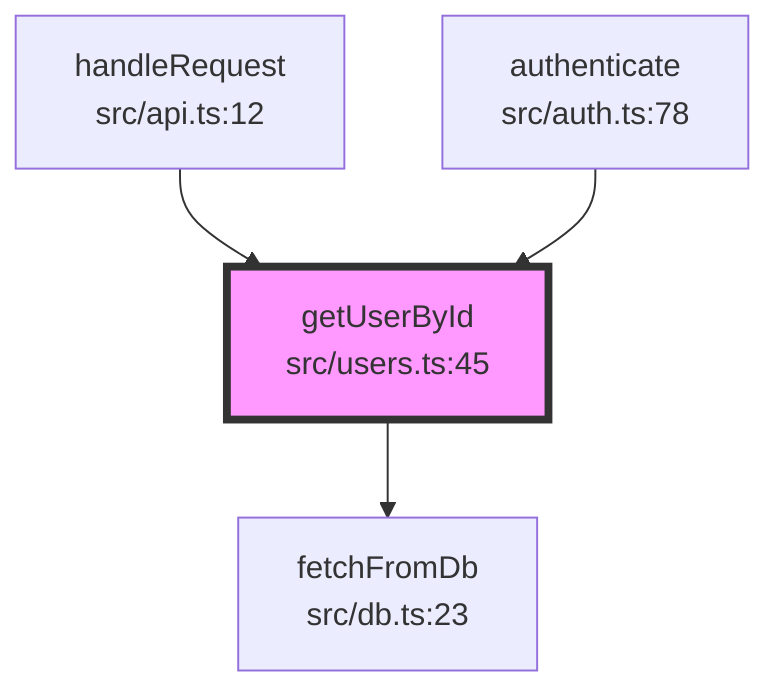

# funcflow

[](https://www.npmjs.com/package/funcflow)
[](https://opensource.org/licenses/MIT)
[](http://makeapullrequest.com)

> MCP server for analyzing function call graphs in TypeScript/JavaScript codebases

## What is funcflow?

funcflow helps developers understand complex codebases by analyzing and visualizing function call relationships. It integrates seamlessly with [Claude Code](https://claude.ai/code) via the Model Context Protocol (MCP).

Simply ask Claude "Show me what calls getUserById" and funcflow will automatically:

- Analyze your codebase using the TypeScript Compiler API
- Find all callers and callees
- Generate beautiful Mermaid diagrams
- Show results directly in Claude Code

## Features

- **Smart Analysis** - Uses TypeScript Compiler API for accurate type-aware analysis
- **Beautiful Visualizations** - Mermaid diagrams, ASCII trees, and JSON export
- **Configurable Depth** - Control how deep to traverse the call graph (1-10 levels)
- **Fast Performance** - Analyzes most functions in <500ms
- **Zero Config** - Works out of the box with any TypeScript/JavaScript project
- **Secure** - Path validation and input sanitization built-in
- **Free & Open Source** - MIT licensed, always free

## Quick Start

### Installation

```bash
# Using npx (no installation needed)
npx funcflow

# Or install globally
npm install -g funcflow
```

### Configure Claude Code

Add to your Claude Code MCP configuration (`~/.claude/settings.json`):

```json
{
  "mcpServers": {
    "funcflow": {
      "command": "npx",
      "args": ["-y", "funcflow"]
    }
  }
}
```

### Usage

Once configured, ask Claude naturally:

```
You: "Show me what calls the getUserById function"
You: "What does processOrder call?"
You: "Analyze the handleCheckout function with depth 3"
```

Claude will automatically use funcflow to analyze your code and show beautiful call graph visualizations.

## MCP Tools

funcflow provides three MCP tools:

### analyze_function_calls

Analyze function call relationships and generate visualizations.

**Parameters:**

- `functionName` (required): Name of the function to analyze
- `projectRoot` (required): Absolute path to project root
- `filePath` (optional): Specific file to search in
- `depth` (optional, default: 2): How deep to traverse (1-10)
- `direction` (optional, default: "both"): "callers", "callees", or "both"

### find_function

Find all definitions of a function by name.

**Parameters:**

- `functionName` (required): Name of the function to find
- `projectRoot` (required): Absolute path to project root

### visualize_callgraph

Generate a visualization in a specific format.

**Parameters:**

- `functionName` (required): Name of the function
- `projectRoot` (required): Absolute path to project root
- `format` (required): "mermaid", "ascii", or "json"
- `depth` (optional, default: 2): How deep to traverse
- `direction` (optional, default: "both"): Analysis direction

## Example Output

### Mermaid Diagram



### ASCII Tree

```
getUserById (src/users.ts:45) ●
├── Called by:
│   ├── handleRequest (src/api.ts:12)
│   └── authenticate (src/auth.ts:78)
└── Calls:
    └── fetchFromDb (src/db.ts:23)
```

## Development

```bash
# Clone the repository
git clone https://github.com/fairy-pitta/funcflow.git
cd funcflow

# Install dependencies
npm install

# Run tests
npm test

# Run tests with coverage
npm run test:coverage

# Build
npm run build

# Development mode (watch)
npm run dev
```

## Configuration

funcflow works with zero configuration. It automatically detects:

- `tsconfig.json` for TypeScript projects
- JavaScript/JSX/TSX files

### Environment Variables

- `FUNCFLOW_LOG_LEVEL`: Logging level (`debug`, `info`, `warn`, `error`). Default: `info`

## Project Structure

```
funcflow/
├── src/
│   ├── analyzer/       # TypeScript analysis engine
│   │   ├── project-scanner.ts
│   │   ├── function-finder.ts
│   │   ├── call-analyzer.ts
│   │   └── typescript-analyzer.ts
│   ├── graph/          # Call graph building
│   │   ├── types.ts
│   │   └── builder.ts
│   ├── visualizer/     # Output generation
│   │   ├── mermaid.ts
│   │   ├── ascii.ts
│   │   └── json.ts
│   ├── mcp/            # MCP server implementation
│   │   ├── server.ts
│   │   ├── handlers.ts
│   │   ├── tools.ts
│   │   └── types.ts
│   ├── utils/          # Utilities
│   │   └── logger.ts
│   └── index.ts        # Entry point
├── tests/              # Test suite
├── docs/               # Documentation
└── plan/               # Implementation plans
```

## Contributing

We welcome contributions! Please see [CONTRIBUTING.md](./CONTRIBUTING.md) for guidelines.

1. Fork the repository
2. Create a feature branch (`git checkout -b feature/amazing-feature`)
3. Write tests for your changes
4. Ensure all tests pass (`npm test`)
5. Commit with clear messages
6. Open a Pull Request

## License

MIT © [fairy-pitta](https://github.com/fairy-pitta)

## Support

- [Report Issues](https://github.com/fairy-pitta/funcflow/issues)
- [Discussions](https://github.com/fairy-pitta/funcflow/discussions)
- Star this repo if you find it useful!

## Acknowledgments

This project was inspired by the need for better tools to understand function call relationships, especially when using AI coding assistants like Claude Code.
