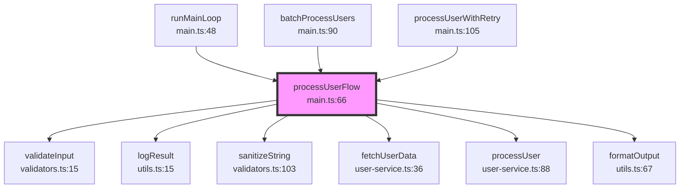

# FuncFlow Demo

This demo showcases funcflow's capabilities for analyzing function call graphs in TypeScript projects.

## Demo Project Structure

The demo project in `demo-project/` contains sample TypeScript files that demonstrate various function patterns:

```
demo-project/
  main.ts          - Main application with entry points and call chains
  user-service.ts  - Service layer with class and function examples
  utils.ts         - Utility functions with various patterns
  validators.ts    - Validation functions with deep call hierarchies
  tsconfig.json    - TypeScript configuration
```

### Key Functions to Explore

| Function              | File            | Description                                                  |
| --------------------- | --------------- | ------------------------------------------------------------ |
| `main`                | main.ts         | Application entry point with initialization chain            |
| `processUserFlow`     | main.ts         | Central processing function with many callers/callees        |
| `circularA`           | main.ts         | Demonstrates circular dependency handling (A -> B -> C -> A) |
| `fetchUserData`       | user-service.ts | Commonly called data fetching function                       |
| `validateInput`       | validators.ts   | Validation with deep call hierarchy                          |
| `processData`         | main.ts         | Arrow function example                                       |
| `UserService.getUser` | user-service.ts | Class method example                                         |

## Running the Demo

### Prerequisites

Make sure you have built the project first:

```bash
cd /path/to/funcflow
npm install
npm run build
```

### Quick Start Commands

```bash
# Run the demo with ASCII output (default)
npm run demo:ascii

# Run the demo with Mermaid diagram output
npm run demo:mermaid

# Run the demo with JSON output
npm run demo:json
```

### Manual CLI Usage

```bash
# Basic usage
npm run demo -- <functionName> [options]

# Options:
#   -p, --project   Project root directory
#   -f, --format    Output format: ascii, mermaid, json
#   -d, --depth     Analysis depth (1-10)
#   --direction     Analysis direction: callers, callees, both

# Examples:
npm run demo -- processUserFlow -p ./demo/demo-project -f ascii -d 3
npm run demo -- main -p ./demo/demo-project --direction callees
npm run demo -- validateInput -p ./demo/demo-project -f json -d 5
```

## Expected Output Examples

### ASCII Tree Output

```
============================================================
  FuncFlow - Function Call Graph Analyzer
============================================================

  Function:  processUserFlow
  Project:   /Users/shuna/funcflow/demo/demo-project
  Format:    ascii
  Depth:     3
  Direction: both

------------------------------------------------------------

processUserFlow (main.ts:66) ●
├── Called by:
│   ├── runMainLoop (main.ts:48)
│   ├── batchProcessUsers (main.ts:90)
│   └── processUserWithRetry (main.ts:105)
└── Calls:
    ├── validateInput (validators.ts:15)
    ├── logResult (utils.ts:15)
    ├── sanitizeString (validators.ts:103)
    ├── fetchUserData (user-service.ts:36)
    ├── processUser (user-service.ts:88)
    ├── formatOutput (utils.ts:67)
    └── logResult (utils.ts:15)

------------------------------------------------------------

  Analysis complete: 36 nodes, 41 edges
```

The ASCII tree shows:

- The target function with its file location and a bullet marker
- **Called by**: Functions that call this function (callers)
- **Calls**: Functions that this function calls (callees)

### Mermaid Diagram Output



The Mermaid output:

- Can be pasted directly into GitHub markdown or any Mermaid-compatible viewer
- Shows the target function highlighted in pink
- Arrows indicate the direction of function calls

### JSON Output

```json
{
  "target": {
    "name": "processUserFlow",
    "location": {
      "file": "/Users/shuna/funcflow/demo/demo-project/main.ts",
      "line": 66,
      "column": 17
    },
    "kind": "function"
  },
  "callers": [
    "runMainLoop",
    "batchProcessUsers",
    "processUserWithRetry"
  ],
  "callees": [
    "validateInput",
    "logResult",
    "sanitizeString",
    "fetchUserData",
    "processUser",
    "formatOutput"
  ],
  "nodes": [...],
  "edges": [...],
  "statistics": {
    "totalNodes": 26,
    "totalEdges": 27,
    "maxDepth": 2
  }
}
```

The JSON output provides:

- Complete structured data for programmatic use
- Target function details with exact location
- Lists of callers and callees
- Full graph nodes and edges
- Analysis statistics

## Circular Dependency Example

FuncFlow handles circular dependencies gracefully:

```bash
npm run demo -- circularA -p ./demo/demo-project -d 5 --direction callees
```

Output:

```
circularA (main.ts:262) ●
└── Calls:
    └── circularB (main.ts:269)

  Analysis complete: 3 nodes, 3 edges
```

The cycle (A -> B -> C -> A) is detected and the analyzer stops at visited nodes to prevent infinite loops.

## Visual Representation

```
                    ┌─────────────────────────────────────────┐
                    │              CALLERS                    │
                    │  (functions that call the target)       │
                    └─────────────────────────────────────────┘
                                      │
                                      │ calls
                                      ▼
    ┌──────────────┐         ┌────────────────┐         ┌──────────────┐
    │  runMainLoop │────────▶│ processUserFlow │◀────────│ batchProcess │
    └──────────────┘         └────────────────┘         └──────────────┘
                                      │
                                      │ calls
                                      ▼
                    ┌─────────────────────────────────────────┐
                    │              CALLEES                    │
                    │  (functions called by the target)       │
                    │                                         │
                    │   validateInput    fetchUserData        │
                    │   sanitizeString   processUser          │
                    │   logResult        formatOutput         │
                    └─────────────────────────────────────────┘
```

## Tips for Best Results

1. **Start with depth 2**: This gives a good overview without too much noise
2. **Use `--direction`**: Focus on callers OR callees when the full graph is too large
3. **Use Mermaid for documentation**: Great for adding call graphs to project docs
4. **Use JSON for tooling**: Parse the JSON output for custom analysis

## Troubleshooting

### Function not found

- Make sure the function name is spelled correctly (case-sensitive)
- Check if the function is exported or accessible
- Verify the project path is correct

### Too many nodes

- Reduce the depth with `-d 1` or `-d 2`
- Focus on one direction with `--direction callers` or `--direction callees`

### Missing callees

- Some built-in functions (console.log, Math.\*, etc.) are filtered out
- Only project-local function calls are tracked
