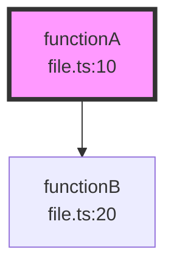

# API Reference

## MCP Tools

### analyze_function_calls

Analyzes function call relationships and generates visualizations.

**Input:**

```typescript
{
  functionName: string;       // Function name to analyze (required)
  projectRoot: string;        // Absolute path to project root (required)
  filePath?: string;          // Optional: specific file to search in
  depth?: number;             // Default: 2, Range: 1-10
  direction?: "callers" | "callees" | "both";  // Default: "both"
}
```

**Output:**

Returns markdown with:

- Mermaid diagram visualization
- Summary of callers and callees
- Total node count

**Example:**

```json
{
  "functionName": "getUserById",
  "projectRoot": "/Users/you/my-project",
  "depth": 3,
  "direction": "both"
}
```

### find_function

Finds all definitions of a function by name.

**Input:**

```typescript
{
  functionName: string; // Function name to find (required)
  projectRoot: string; // Absolute path to project root (required)
}
```

**Output:**

Returns markdown list of all function definitions with:

- File path
- Line number
- Function type (function, method, arrow, expression)

### visualize_callgraph

Generates a visualization in a specific format.

**Input:**

```typescript
{
  functionName: string;       // Function name (required)
  projectRoot: string;        // Absolute path to project root (required)
  format: "mermaid" | "ascii" | "json";  // Output format (required)
  depth?: number;             // Default: 2, Range: 1-10
  direction?: "callers" | "callees" | "both";  // Default: "both"
}
```

**Output Formats:**

#### Mermaid



#### ASCII

```
functionA (file.ts:10) ●
├── Called by:
│   └── caller1 (file.ts:5)
└── Calls:
    └── callee1 (file.ts:15)
```

#### JSON

```json
{
  "target": {
    "name": "functionA",
    "location": { "file": "file.ts", "line": 10, "column": 1 },
    "kind": "function"
  },
  "callers": ["caller1"],
  "callees": ["callee1"],
  "nodes": [...],
  "edges": [...],
  "statistics": {
    "totalNodes": 3,
    "totalEdges": 2,
    "maxDepth": 1
  }
}
```

## Environment Variables

| Variable             | Description                                     | Default |
| -------------------- | ----------------------------------------------- | ------- |
| `FUNCFLOW_LOG_LEVEL` | Logging level: `debug`, `info`, `warn`, `error` | `info`  |

## Error Handling

Common errors:

| Error                                  | Cause                             | Solution                                      |
| -------------------------------------- | --------------------------------- | --------------------------------------------- |
| "Function not found"                   | Function name doesn't exist       | Check spelling, ensure function is in project |
| "projectRoot must be an absolute path" | Relative path provided            | Use absolute path                             |
| "No source files found"                | Empty project or missing tsconfig | Add tsconfig.json or ensure files exist       |
