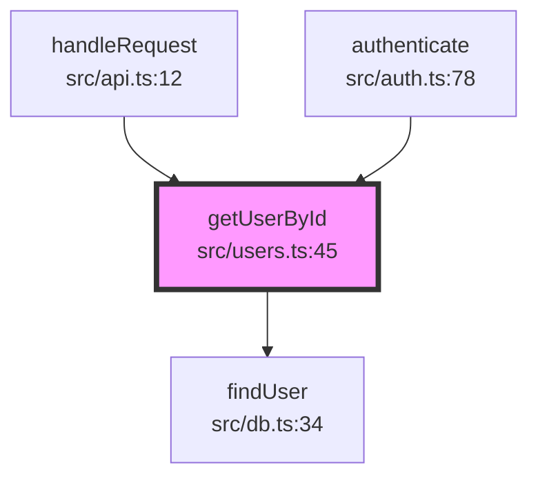

# Visualization Implementation Plan

## Overview

The visualizer converts call graph data into human-readable formats: Mermaid diagrams, ASCII trees, and JSON exports.

## Output Formats

### 1. Mermaid Diagram

**Use case:** Rich visualization in Claude Code and Markdown viewers

**Example output:**



### 2. ASCII Tree

**Use case:** Quick terminal output, logs

**Example output:**

```
getUserById (src/users.ts:45) ●
├── Called by:
│   ├── handleRequest (src/api.ts:12)
│   └── authenticate (src/auth.ts:78)
└── Calls:
    ├── findUser (src/db.ts:34)
    └── validateId (src/utils.ts:56)
```

### 3. JSON Export

**Use case:** Machine-readable format for further processing

**Example output:**

```json
{
  "target": {
    "name": "getUserById",
    "location": {
      "file": "src/users.ts",
      "line": 45
    }
  },
  "callers": ["handleRequest", "authenticate"],
  "callees": ["findUser", "validateId"],
  "edges": [
    {
      "from": "handleRequest",
      "to": "getUserById",
      "location": { "file": "src/api.ts", "line": 12 }
    }
  ]
}
```

## Implementation

### 1. Mermaid Generator

```typescript
// src/visualizer/mermaid.ts
import { CallGraph, FunctionNode } from "../graph/types.js";
import path from "path";

export function generateMermaidDiagram(graph: CallGraph): string {
  const lines: string[] = ["graph TD"];

  // Generate node definitions
  for (const [name, node] of graph.nodes) {
    const nodeId = sanitizeNodeId(name);
    const label = formatNodeLabel(node);
    const style =
      name === graph.targetNode.name
        ? "fill:#f9f,stroke:#333,stroke-width:4px"
        : "";

    lines.push(`    ${nodeId}["${label}"]`);
    if (style) {
      lines.push(`    style ${nodeId} ${style}`);
    }
  }

  // Generate edges
  for (const edge of graph.edges) {
    const fromId = sanitizeNodeId(edge.from);
    const toId = sanitizeNodeId(edge.to);
    lines.push(`    ${fromId} --> ${toId}`);
  }

  return lines.join("\n");
}

function sanitizeNodeId(name: string): string {
  // Remove special characters that break Mermaid syntax
  return name.replace(/[^a-zA-Z0-9_]/g, "_");
}

function formatNodeLabel(node: FunctionNode): string {
  const shortPath = path.basename(node.location.file);
  const label = `${node.name}<br/>${shortPath}:${node.location.line}`;
  // Escape quotes and special chars
  return label.replace(/"/g, '\\"');
}
```

### 2. ASCII Tree Generator

```typescript
// src/visualizer/ascii.ts
import { CallGraph, FunctionNode } from "../graph/types.js";
import path from "path";

export function generateAsciiTree(graph: CallGraph): string {
  const lines: string[] = [];
  const target = graph.targetNode;

  // Header
  lines.push(`${target.name} (${formatLocation(target)}) ●`);

  // Callers section
  if (graph.callers.length > 0) {
    lines.push("├── Called by:");
    graph.callers.forEach((caller, index) => {
      const node = graph.nodes.get(caller);
      const isLast =
        index === graph.callers.length - 1 && graph.callees.length === 0;
      const prefix = isLast ? "└──" : "├──";
      const continuation = isLast ? "    " : "│   ";

      if (node) {
        lines.push(`│   ${prefix} ${caller} (${formatLocation(node)})`);
      }
    });
  }

  // Callees section
  if (graph.callees.length > 0) {
    const hasCallers = graph.callers.length > 0;
    const prefix = hasCallers ? "└──" : "├──";

    lines.push(`${prefix} Calls:`);

    graph.callees.forEach((callee, index) => {
      const node = graph.nodes.get(callee);
      const isLast = index === graph.callees.length - 1;
      const edgePrefix = isLast ? "└──" : "├──";

      if (node) {
        lines.push(`    ${edgePrefix} ${callee} (${formatLocation(node)})`);
      }
    });
  }

  return lines.join("\n");
}

function formatLocation(node: FunctionNode): string {
  const shortPath = path.basename(node.location.file);
  return `${shortPath}:${node.location.line}`;
}
```

### 3. Detailed ASCII Tree (with depth)

```typescript
// src/visualizer/ascii-detailed.ts
import { CallGraph } from "../graph/types.js";

export function generateDetailedTree(
  graph: CallGraph,
  direction: "callers" | "callees" = "callees",
): string {
  const lines: string[] = [];
  const visited = new Set<string>();

  traverse(graph.targetNode.name, "", true);

  return lines.join("\n");

  function traverse(nodeName: string, prefix: string, isLast: boolean) {
    if (visited.has(nodeName)) {
      lines.push(`${prefix}${isLast ? "└──" : "├──"} ${nodeName} (circular)`);
      return;
    }

    visited.add(nodeName);

    const node = graph.nodes.get(nodeName);
    if (!node) return;

    const connector = isLast ? "└──" : "├──";
    const location = formatLocation(node);
    lines.push(`${prefix}${connector} ${nodeName} ${location}`);

    // Get children
    const children =
      direction === "callees"
        ? graph.edges.filter((e) => e.from === nodeName).map((e) => e.to)
        : graph.edges.filter((e) => e.to === nodeName).map((e) => e.from);

    const newPrefix = prefix + (isLast ? "    " : "│   ");
    children.forEach((child, i) => {
      traverse(child, newPrefix, i === children.length - 1);
    });

    visited.delete(nodeName);
  }
}
```

### 4. JSON Exporter

```typescript
// src/visualizer/json.ts
import { CallGraph } from "../graph/types.js";

export interface JsonOutput {
  target: {
    name: string;
    location: {
      file: string;
      line: number;
      column: number;
    };
    kind: string;
  };
  callers: string[];
  callees: string[];
  nodes: Array<{
    name: string;
    location: {
      file: string;
      line: number;
      column: number;
    };
    kind: string;
  }>;
  edges: Array<{
    from: string;
    to: string;
    location: {
      file: string;
      line: number;
    };
  }>;
  statistics: {
    totalNodes: number;
    totalEdges: number;
    maxDepth: number;
  };
}

export function exportToJson(graph: CallGraph): string {
  const output: JsonOutput = {
    target: {
      name: graph.targetNode.name,
      location: graph.targetNode.location,
      kind: graph.targetNode.kind,
    },
    callers: graph.callers,
    callees: graph.callees,
    nodes: Array.from(graph.nodes.values()).map((node) => ({
      name: node.name,
      location: node.location,
      kind: node.kind,
    })),
    edges: graph.edges.map((edge) => ({
      from: edge.from,
      to: edge.to,
      location: edge.location,
    })),
    statistics: {
      totalNodes: graph.nodes.size,
      totalEdges: graph.edges.length,
      maxDepth: calculateMaxDepth(graph),
    },
  };

  return JSON.stringify(output, null, 2);
}

function calculateMaxDepth(graph: CallGraph): number {
  // Implementation from graph/statistics.ts
  let maxDepth = 0;
  const visited = new Set<string>();

  function dfs(node: string, depth: number) {
    if (visited.has(node)) return;
    visited.add(node);
    maxDepth = Math.max(maxDepth, depth);

    const neighbors = graph.edges
      .filter((e) => e.from === node)
      .map((e) => e.to);
    for (const neighbor of neighbors) {
      dfs(neighbor, depth + 1);
    }
  }

  dfs(graph.targetNode.name, 0);
  return maxDepth;
}
```

## Color Coding (for terminal output)

```typescript
// src/visualizer/colors.ts
import chalk from "chalk";

export const colors = {
  target: chalk.magenta.bold,
  caller: chalk.blue,
  callee: chalk.green,
  location: chalk.gray,
  edge: chalk.yellow,
  cycle: chalk.red,
};

export function colorizeTree(tree: string): string {
  // Add colors to ASCII tree output
  return tree
    .split("\n")
    .map((line) => {
      if (line.includes("●")) return colors.target(line);
      if (line.includes("Called by:")) return colors.caller(line);
      if (line.includes("Calls:")) return colors.callee(line);
      if (line.includes("(circular)")) return colors.cycle(line);
      return line;
    })
    .join("\n");
}
```

## Advanced Visualization Features

### 1. Compact Mode

For large graphs, show only immediate connections:

```typescript
export function generateCompactView(graph: CallGraph): string {
  const target = graph.targetNode.name;
  const directCallers = graph.callers.slice(0, 5);
  const directCallees = graph.callees.slice(0, 5);

  let output = `${target}\n`;
  output += `  Callers (${graph.callers.length}): ${directCallers.join(", ")}`;
  if (graph.callers.length > 5)
    output += `, ... (+${graph.callers.length - 5} more)`;
  output += `\n`;
  output += `  Callees (${graph.callees.length}): ${directCallees.join(", ")}`;
  if (graph.callees.length > 5)
    output += `, ... (+${graph.callees.length - 5} more)`;

  return output;
}
```

### 2. Interactive HTML (future)

Generate an interactive D3.js visualization:

```typescript
export function generateHtml(graph: CallGraph): string {
  return `
<!DOCTYPE html>
<html>
<head>
  <script src="https://d3js.org/d3.v7.min.js"></script>
  <style>
    /* D3 force graph styles */
  </style>
</head>
<body>
  <div id="graph"></div>
  <script>
    const data = ${JSON.stringify(graph)};
    // D3 force graph implementation
  </script>
</body>
</html>
  `;
}
```

## Testing

```typescript
// tests/visualizer.test.ts
import { describe, it, expect } from "vitest";
import {
  generateMermaidDiagram,
  generateAsciiTree,
  exportToJson,
} from "../src/visualizer";

describe("Mermaid Generator", () => {
  it("generates valid Mermaid syntax", () => {
    const graph = createTestGraph();
    const mermaid = generateMermaidDiagram(graph);

    expect(mermaid).toContain("graph TD");
    expect(mermaid).toContain("-->");
    expect(mermaid).not.toContain('"undefined"');
  });

  it("highlights target node", () => {
    const graph = createTestGraph();
    const mermaid = generateMermaidDiagram(graph);

    expect(mermaid).toContain("style");
    expect(mermaid).toContain("fill:#f9f");
  });
});

describe("ASCII Tree Generator", () => {
  it("generates tree structure", () => {
    const graph = createTestGraph();
    const tree = generateAsciiTree(graph);

    expect(tree).toContain("├──");
    expect(tree).toContain("└──");
    expect(tree).toContain("●");
  });
});

describe("JSON Exporter", () => {
  it("exports valid JSON", () => {
    const graph = createTestGraph();
    const json = exportToJson(graph);

    const parsed = JSON.parse(json);
    expect(parsed).toHaveProperty("target");
    expect(parsed).toHaveProperty("edges");
    expect(parsed).toHaveProperty("statistics");
  });
});
```

## Integration with MCP

The visualizer output is returned to Claude Code as markdown:

```typescript
// In MCP handler
const mermaid = generateMermaidDiagram(graph);
const ascii = generateAsciiTree(graph);

return {
  content: [
    {
      type: "text",
      text:
        `## Call Graph: \`${functionName}\`\n\n` +
        `### Mermaid Diagram\n\n\`\`\`mermaid\n${mermaid}\n\`\`\`\n\n` +
        `### ASCII Tree\n\n\`\`\`\n${ascii}\n\`\`\``,
    },
  ],
};
```

## Next Steps

After completing the visualizer:

1. Write comprehensive tests
2. Integrate all components
3. Test with Claude Code
4. Optimize performance
